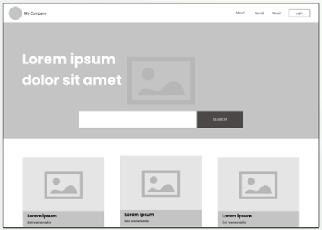
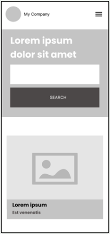

# Mission 0 - Marketing Association NZ Website

## About The Project

This is a website that is built with React/Vite and Tailwind CSS for my first mission project for my Level 5 Advanced FullStack Development program.
The focus on this assignment is to apply responsiveness to the website.

[![React][React.js]][React-url]
[![Tailwind][Tailwind.css]][Tailwind-url]

## Project Brief

You are contracted by Marketing Association New Zealand to build a quick page as a template for their new digital news home page.

- Build an application using any front-end framework of your choice with a home page using the wireframe shared as guidance.
- You can use your own color palette and pictures.
- Search functionality need not be implemented.

Make the webpage responsive using the wireframe below as guidance.

<!-- MARKDOWN LINKS & IMAGES -->

[React.js]: https://img.shields.io/badge/React-20232A?style=for-the-badge&logo=react&logoColor=61DAFB
[React-url]: https://reactjs.org/
[Tailwind.css]: https://img.shields.io/badge/Tailwind_CSS-grey?style=for-the-badge&logo=tailwind-css&logoColor=38B2AC
[Tailwind-url]: https://tailwindcss.com/
